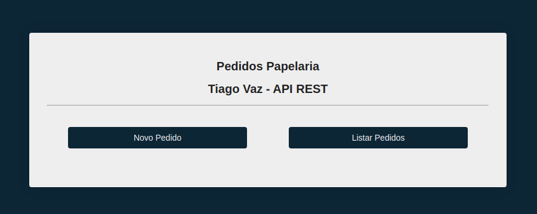
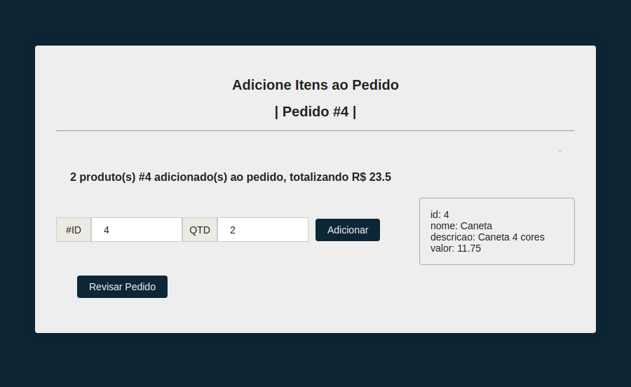
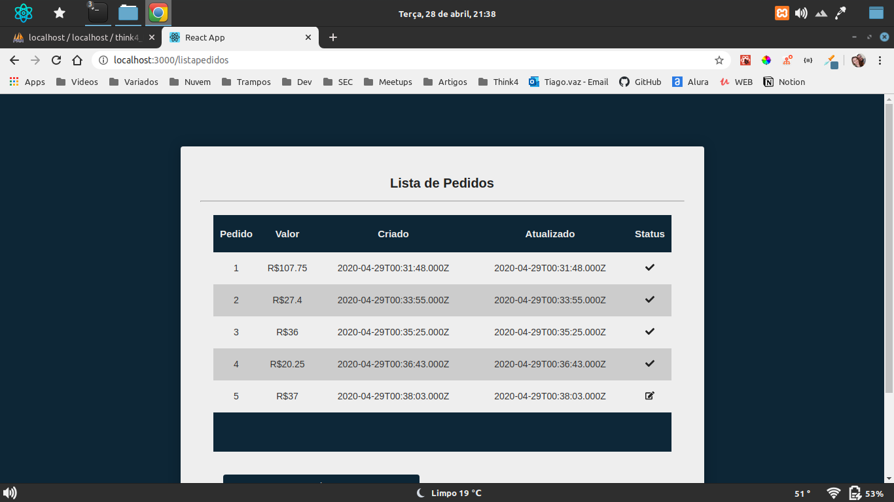

# PedidosPapelaria
> Projeto que armazena pedidos de uma papelaria.

Aplicação desenvolvida em MySql, Node.js e ReactJS

|Tela Inicial                                                                            |
|:--------------------------------------------------------------------------------------:|
|                                | 
|Tela inicial do app onde pode escolher cadastrar um novo pedido ou listar os existentes | 

|Adicionar itens ao pedido                                |
|:-------------------------------------------------------:|
| |
|Adiciona o pedido pelo códio e quantdade                 |

|Revisão Pedido                                           |
|:-------------------------------------------------------:|
| |
|Itens aparecem individualmente e podem ser removidos. Pedidos pode ser salvos para edição 
posterior ou finalizados.     |

|Lista de Pedidos                                         |
|:-------------------------------------------------------:|
| |
|Lista todos os pedidos realizados. Pedidos que foram salvos podem ser selecionados para 
edição. Pedidos finalizados não podem ser mais editados              |

### Como instalar:

#### Banco de dados:

**Ambiente de desenvolvimento**
- XAMP7.4.2 | [Download](https://www.apachefriends.org/pt_br/index.html) 
- Host: localhost 
- Porta: 3306 
- User: root 
- Password: ‘’(Vazio)
- Database: pedidosPapelaria

**Instalação banco de Dados**
1. Faça o download do XAMP
2. Instale e inicie o servidor 
3. No navegador vá para [http://localhost/phpmyadmin/](http://localhost/phpmyadmin/)
4. Rode o script pedidosPapelaria.sql que está na pasta Banco de dados

Isso ira criar e popular o banco de dados necessário para rodar a aplicação


#### API Rest Node
- Node:10.18.1  | [Download](https://nodejs.org/en/)
- npm:6.13.4    | Faz parte da instalação do Node
- yarn:1.22.0   | [Download](https://classic.yarnpkg.com/en/docs/install/#windows-stable)

**Instalção das dependências**
1. Instale o Node e o Yarn
2. Abra um terminal e navegue até a pasta backend
3. Insira o comando: 
```
npm install
```
4. Após a instação digite o comando:
```
yarn dev
```

Isso irá iniciar um servidor do Node na porta 3333 da sua máquina.

#### Frontend ReactJS
- ReactJS:16.12.0
- yarn:1.22.0

**Intalação das dependências**
1. Dentro da pasta web, abra uma instancia do terminal edigite:
```
yarn
```
> Essa instalação demora um pouco mais, isso é normal, o frontend utiliza mais dependências que o backend.
2. Após a instalação digite o comando:
```
yarn start
```
> Isso irá abrir o browser no endereço http://localhost:3000
> Esse processo também é um pouco demorado na primeira vez que é executado.

